# Identity & Access Management (IAM)

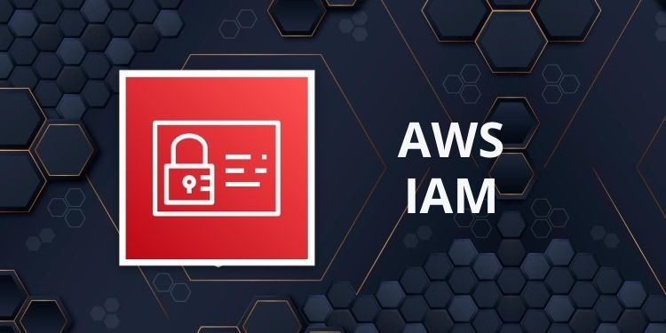

### IAM: Users & Groups

- **<span style="color:#1E90FF">Identity and Access Management (IAM)</span>** - is a critical AWS service that provides fine-grained access control across all AWS resources (With `IAM`, you can create and manage AWS `users` and `groups`, and use `permissions` to allow or deny their access to AWS resources). It's a <span style="color:#1E90FF">global service</span>, meaning it operates consistently across all AWS regions.


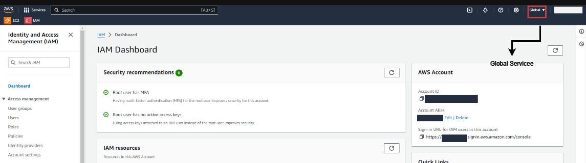
<p>

- **<span style="color:#1E90FF">The Root Account -</span>** A Special Entity. When you first create an AWS account, a root account is generated automatically. This account has unrestricted access to all AWS services and resources within the account. Due to its powerful nature, it's highly recommended to avoid using the root account for daily tasks and never share its credentials. Instead, create individual users and assign them appropriate permissions.

- **<span style="color:#1E90FF">IAM Users -</span>** Individual Entities. IAM users are entities that represent individuals or applications in your organization. Each user is created under your AWS account and is given specific permissions to access AWS resources. These users have their credentials (passwords, access keys, etc.) and can be managed independently.

- **<span style="color:#1E90FF">IAM Groups -</span>** Organizing Users. IAM groups allow you to organize users and manage permissions collectively. A group is simply a collection of IAM users, and it’s an effective way to assign the same set of permissions to multiple users simultaneously. For instance, you might create a group for developers, assigning them the permissions they need to perform their tasks.

- Key Points about Groups and Users:

    - <span style="color:#1E90FF">Groups Only Contain Users :</span> IAM groups can only include `users` and `cannot contain other groups`. This ensures a straightforward and understandable permission management structure.
    - <span style="color:#1E90FF">Users Can Belong to Multiple Groups :</span> An IAM user `doesn't have to belong to a group`, but they can belong to `multiple groups`. This flexibility allows you to easily manage permissions by adding or removing users from groups as needed.

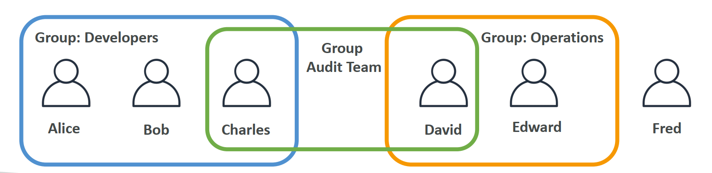
<p>

> **⚠️ Note:**
> 
> An IAM Group is not an identity and cannot be identified as a principal in an IAM policy
> 
> Only users and services can assume a role (not groups)
>
> A new IAM user created using the AWS CLI or AWS API has no AWS credentials

### IAM: Permissions


<p>

- <span style="color:#1E90FF">IAM Permissions</span> in AWS are the rules that define what actions users or groups can perform on specific resources. These permissions are managed through policies, which are JSON documents that specify the allowed or denied actions.

- **<span style="color:#1E90FF">Policies:</span>** The Building Blocks of Permissions
    > Policies are the core mechanism in IAM to manage permissions. They can be attached to individual users or groups of users. A policy document is written in JSON format and contains one or more statements that define the permissions. Each statement specifies the effect (either `Allow` or `Deny`), the action(s) that are permitted or denied, and the resources to which these actions apply.

- **<span style="color:#1E90FF">Applying the Principle of Least Privilege</span>**
    > In AWS, it's crucial to follow the principle of least privilege when assigning permissions. This principle means that you should grant users and groups the minimum level of access they need to perform their tasks—nothing more. By doing so, you reduce the risk of unauthorized access and potential security breaches.

Below is an example of a policy that grants specific read-only permissions across several AWS services

```json
{
    "Version": "2012-10-17",
    "Statement": [
        {
            "Effect": "Allow",
            "Action": "ec2:Describe*",
            "Resource": "*"
        },
        {
            "Effect": "Allow",
            "Action": "elasticloadbalancing:Describe*",
            "Resource": "*"
        },
        {
            "Effect": "Allow",
            "Action": [
                "cloudwatch:ListMetrics",
                "cloudwatch:GetMetricStatistics",
                "cloudwatch:Describe*"
            ],
            "Resource": "*"
        }
    ]
}
```

- The `Version` specifies the version of the policy language.
- The `Statement` array includes multiple statements, each with an Effect, Action, and Resource.
- The `Effect` is set to Allow, meaning the specified actions are permitted.
- The `Action` defines the specific operations that are allowed, such as describing EC2 instances or listing CloudWatch metrics.
- The `Resource` is set to "*", meaning the actions apply to all resources.

### IAM Policies inheritance

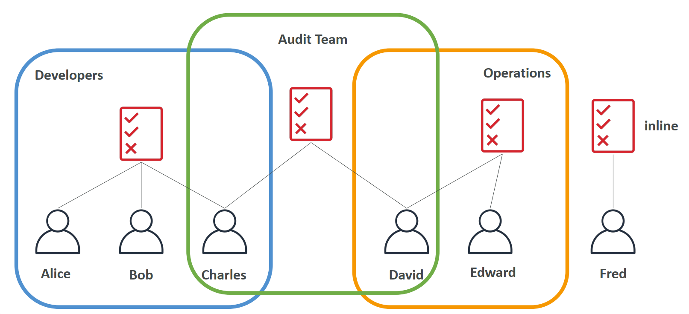
<p>

- **Developers Group:** Alice, Bob, and Charles are part of the Developers group. This group has a policy attached to it that defines specific permissions.

- **Operations Group:** David and Edward are members of the Operations group, which has its own policy.

- **Audit Team:** Charles, who is also a part of the Developers group, belongs to the Audit Team. Similarly, David , who is also a part of the Operations group, belongs to the Audit Team. This team has a different set of permissions defined by another policy.

- **Inline Policies:** Fred has a unique case where he is not part of any group but instead has an inline policy directly attached to him.

> **⚠️ Key Points:**
>
> **Multi-Group Membership:** A user can belong to multiple groups, and thus, inherit permissions from multiple policies. This allows for flexibility in defining complex access controls.
>
> **Combining Permissions:** When a user is part of more than one group, their effective permissions are a combination of all the policies attached to those groups. This can be both an advantage, allowing for granular control, and a challenge, as it may lead to unintended permissions if not carefully managed.
>
> **Inline Policies:** These are policies `directly` attached to an individual user rather than a group. They are specific to the user and not shared or inherited by other users.
>
> **Least Privilege Principle:** Even with inheritance, it’s essential to apply the principle of least privilege—granting only the permissions necessary for a user to perform their tasks. Over-permissioning can occur if a user inherits too many permissions from multiple sources.


### IAM Policies Structure

When working with AWS Identity and Access Management (IAM), it's essential to understand the structure of IAM policies. These policies are the fundamental building blocks that define permissions and access controls within AWS.

- Policies are JSON documents that outline permissions for users, groups or roles

- Two types
    - **User based policies**
        - IAM policies define which API calls should be allowed for a specific user
    - **Resource based policies*
        - Control access to an AWS resource
        - Grant the specified principal permission to perform actions on the resource and define under what conditions this applies

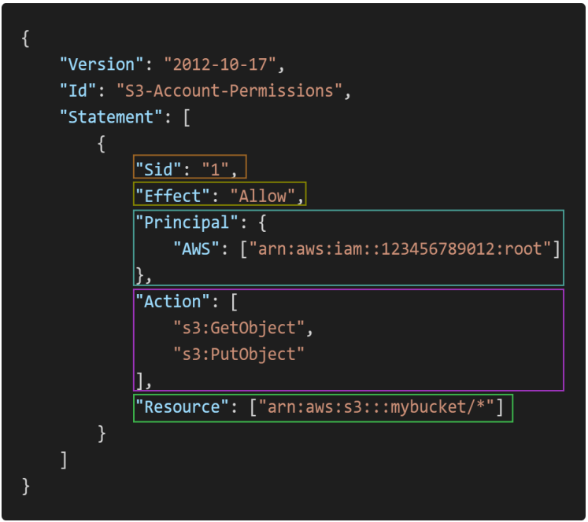
<p>

#### Components of an IAM Policy

An IAM policy is a JSON document that consists of various elements, each serving a specific purpose. Here’s a breakdown of the key components:

1. Version
    - **Definition:** Specifies the language version of the policy. It's crucial to always include the version element in your policies.
    - **Value:** `"2012-10-17"` is the most current version and should be used for all new policies.

2. Id (Optional)
    - **Definition:** An identifier for the policy. This element is optional but can be useful for managing and identifying policies, especially in environments with numerous policies.

3. Statement
    - **Definition:** The core element of a policy, containing one or more individual statements. Each statement defines a single permission or a set of permissions.
    - **Structure:** A policy can have multiple statements, each addressing different actions, resources, or conditions.

    - **Components of a Statement** : Each statement within a policy has its own set of components:

        - **Sid (Optional)**
            - **Definition:** A unique identifier for the statement. This is optional but can be helpful when managing complex policies with multiple statements.

        - **Effect**
            - **Definition:** Specifies whether the statement `allows` or `denies` access.
            - **Values:** 
                - `Allow` grants the specified permissions.
                - `Deny` explicitly blocks the specified permissions.
        - **Principal**
            - **Definition:** Identifies the AWS account, user, or role to which the policy applies. This element is crucial when defining who the policy is for.
        - **Action**
            - **Definition:** A list of actions that the policy allows or denies. Actions are operations that can be performed on AWS resources, such as `s3:GetObject` or `ec2:StartInstances`.
        - **Resource**
            - **Definition:** Specifies the AWS resources to which the actions apply. This can include specific resources (e.g., an S3 bucket) or a wildcard (`*`) to apply to all resources.
        - **6. Condition (Optional)**
            - **Definition:** Specifies the circumstances under which the policy is in effect. Conditions can be used to add granularity, such as allowing access only from a specific IP address range or during a certain time period.

### IAM – Password Policy:

- Strong passwords = higher security for your account
- In AWS, you can setup a password policy:
    - Set a minimum password length
    - Require specific character types:
        - including uppercase letters
        - lowercase letters
        - numbers
        - non-alphanumeric characters
- Allow all IAM users to change their own passwords
- Require users to change their password after some time (password expiration)
- Prevent password re-use

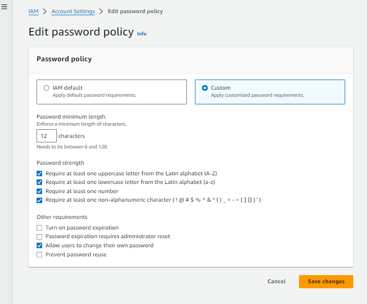
<p>

#### Multi Factor Authentication - MFA

- Users have access to your account and can possibly change
configurations or delete resources in your AWS account
- **You want to protect your Root Accounts and IAM users**
- MFA = password you know + security device you own

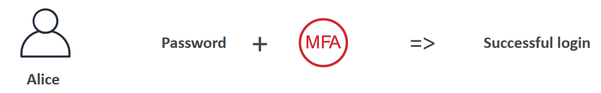
<p>

- **Main benefit of MFA:** if a password is stolen or hacked, the account is not compromised

#### MFA devices options in AWS

Multi-Factor Authentication (MFA) adds an additional layer of security to your AWS account by requiring a second form of authentication, typically something you have, like a device, in addition to your password. There are various types of MFA devices you can use, such as:

- **Virtual MFA Devices:** Applications like Google Authenticator and Authy, which generate time-based one-time passwords (TOTP) on your phone.

- **Hardware MFA Devices:** Physical devices like YubiKey, which can be used for multiple IAM users, or other key fobs that generate time-based one-time passwords.

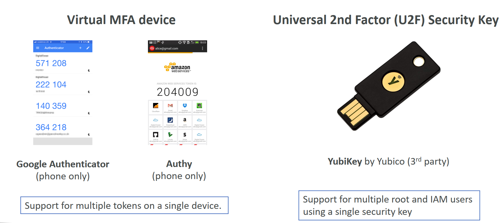
<p>

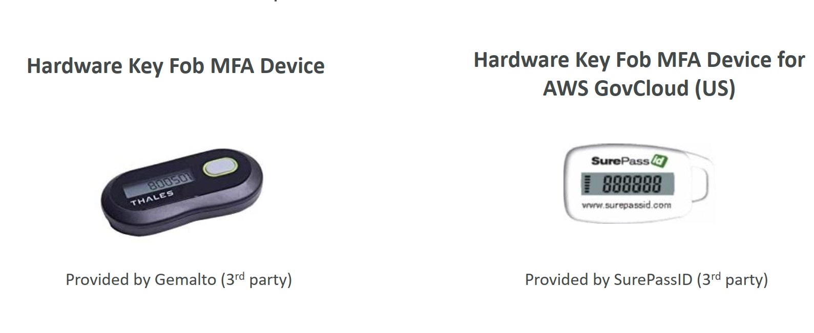
<p>

These devices enhance the security of your AWS account by ensuring that even if your password is compromised, the attacker would still need the second factor to gain access.

### How can users access AWS ?

- To access AWS, you have three options:
    1. **AWS Management Console:** This is a web-based interface that allows users to manage AWS services visually. It is secured by a combination of a password and Multi-Factor Authentication (MFA), ensuring an additional layer of security beyond just a password.
    2. **AWS Command Line Interface (CLI):** The CLI allows users to interact with AWS services via command-line commands. This is particularly useful for automation and managing AWS resources programmatically. Access to the CLI is protected by Access Keys, which consist of an Access Key ID and a Secret Access Key. These keys are unique to each user and act as credentials that grant permission to access AWS services. The CLI is popular among developers and system administrators who need to perform complex tasks or automate workflows.
    3. **AWS Software Development Kit (SDK):** The SDK is designed for integrating AWS services directly into your applications through code. It provides APIs that allow developers to interact with AWS services in a variety of programming languages, including Java, Python, and JavaScript. Like the CLI, the SDK requires Access Keys for authentication. These keys are managed by users and should be treated with the same level of security as a password, as they grant programmatic access to AWS resources.

#### Access Keys:
- Access Keys are generated through the AWS Console
- Users manage their own access keys
- **Users manage their own access keys**
- Access Key ID ~= username
- Secret Access Key ~= password

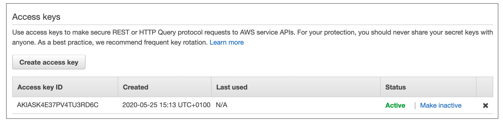
<p>

- Access key ID: AKIASK4E37PV4983d6C
- Secret Access Key: AZPN3zojWozWCndIjhB0Unh8239a1bzbzO5fqqkZq
- **Remember: don’t share your access keys**

#### What’s the AWS CLI?

- A tool that enables you to interact with AWS services using commands in your command-line shell
- Direct access to the public APIs of AWS services
- You can develop scripts to manage your resources
- It’s open-source https://github.com/aws/aws-cli
- Alternative to using AWS Management Console
- Setup CLI https://docs.aws.amazon.com/cli/latest/userguide/getting-started-install.html

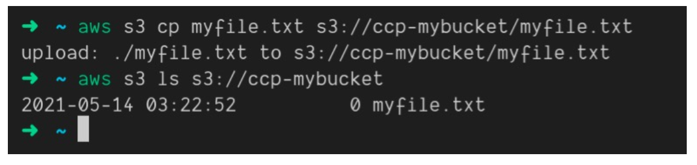
<p>

#### What’s the AWS SDK?

<p>
  <span style="display: inline-block; width: 60%;">
    - AWS Software Development Kit (AWS SDK)<br>
    - Language-specific APIs (set of libraries)<br>
    - Enables you to access and manage AWS services programmatically<br>
    - Embedded within your application<br>
    - Supports<br>
    &nbsp;&nbsp;&nbsp;&nbsp;- SDKs (JavaScript, Python, PHP, .NET, Ruby, Java, Go, Node.js, C++)<br>
    &nbsp;&nbsp;&nbsp;&nbsp;- Mobile SDKs (Android, iOS, …)<br>
    &nbsp;&nbsp;&nbsp;&nbsp;- IoT Device SDKs (Embedded C, Arduino, …)<br>
    - Example: AWS CLI is built on AWS SDK for Python
  </span>
  <span style="display: inline-block; width: 35%; vertical-align: top; text-align: center;">
    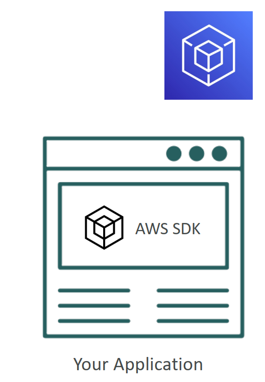
  </span>
</p>

#### AWS CloudShell

AWS CloudShell is a browser-based shell environment available directly in the AWS Management Console. It provides a convenient way to securely manage, interact with, and automate AWS resources from your browser. Here are the key points:

- **Pre-installed Tools:** `AWS CLI`, `Git`, and other essential tools are pre-installed, so you can start working immediately without any setup.
- **Persistent Storage:** `1 GB` of persistent storage is available for your home directory, allowing you to store scripts and other files.
- **Security:** Access to resources is securely managed via your IAM credentials, ensuring secure operations.
- Avalibility AWS Regions for AWS CloudShell https://docs.aws.amazon.com/cloudshell/latest/userguide/supported-aws-regions.html

AWS CloudShell is ideal for users who need a quick and easy way to manage AWS services without setting up a local environment.

### IAM Roles for Services

<p>
  <span style="display: inline-block; width: 60%;">
    - Some AWS service will need to perform actions on your behalf <br>
    - To do so, we will assign <b>permissions</b> to AWS services with <b>IAM Roles</b><br>
    - IAM roles provide permissions to entities you trust: AWS services, users, or applications. <br>
    - Roles are designed to be assumed by anyone or anything that requires them, unlike users who are tied to a specific individual.<br>
    - Common roles:<br>
    &nbsp;&nbsp;&nbsp;&nbsp;- EC2 Instance Roles<br>
    &nbsp;&nbsp;&nbsp;&nbsp;- Lambda Function Roles<br>
    &nbsp;&nbsp;&nbsp;&nbsp;- Roles for CloudFormation<br>
  </span>
  <span style="display: inline-block; width: 35%; vertical-align: top; text-align: center;">
    
  </span>
</p>

- Steps to Create a Custom IAM Role
    - Navigate to IAM in AWS Console: Go to the IAM section in your AWS Management Console.
    - **Create a Role:**
        - Click on `Roles` in the navigation pane and select `Create role`.
        - Choose the type of trusted entity (e.g., AWS service, another AWS account, web identity, etc.).
    - **Select Use Case:** Depending on the trusted entity, select the specific use case, like allowing S3 access for an EC2 instance.

    **Trusted entities**
    ```json
    {
        "Version": "2012-10-17",
        "Statement": [
            {
                "Effect": "Allow",
                "Principal": {
                    "Service": "ec2.amazonaws.com"
                },
                "Action": "sts:AssumeRole"
            }
        ]
    }
    ```
    - **Attach Permissions:** Choose or create a policy that specifies the permissions this role will have. You can either attach an existing policy or create a new one.
    - **Set Trust Relationship:** Define which entities can assume this role by setting up a trust policy.
    - **Name the Role:** Give your role a descriptive name and add an optional description.
    - **Review and Create:** Review the settings and create the role.


For a detailed walkthrough on creating a custom IAM role, you can watch this [YouTube tutorial](https://www.youtube.com/watch?v=2eu0YqbaOyo&t=130s).


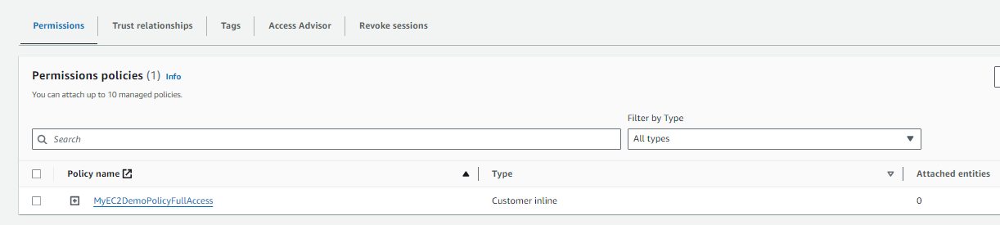
<p>

> **⚠️ Trust Policies:**
>
> Defines which principal entities (accounts, users, roles, federated users) can assume the role
>
> An IAM role is both an `identity` and a `resource` that supports `resource-based policies`.
>
> You must attach both a `trust policy` and an `identity-based` policy to an IAM role.
>
> The `IAM service supports only one type of resource-based policy` called a `role trust policy`, which is attached to an `IAM role`.

> **⚠️ Roles:**
>
> Collection of policies for AWS services
> 
> If you are going to use an `IAM Service Role` with `Amazon EC2` or another AWS service that uses `Amazon EC2`, you must store the role in an `instance profile`. When you create an `IAM service role for EC2`, the role automatically has EC2 identified as a trusted entity.