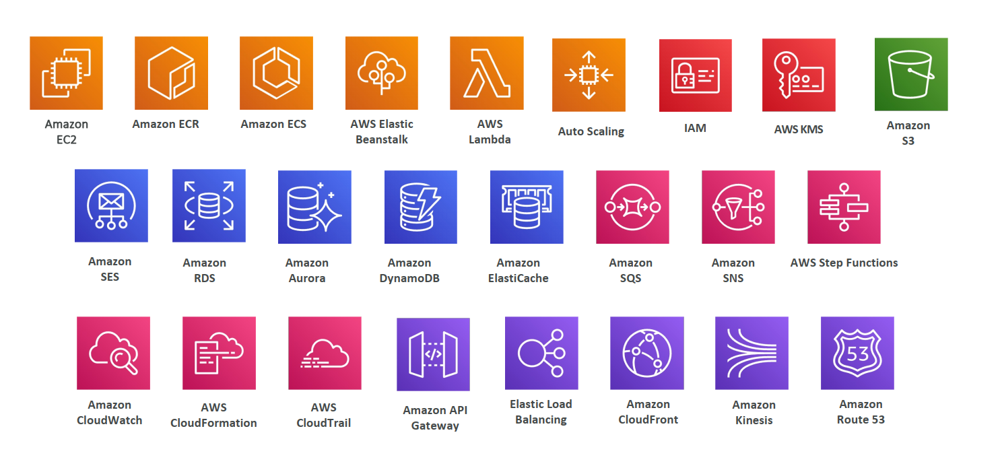
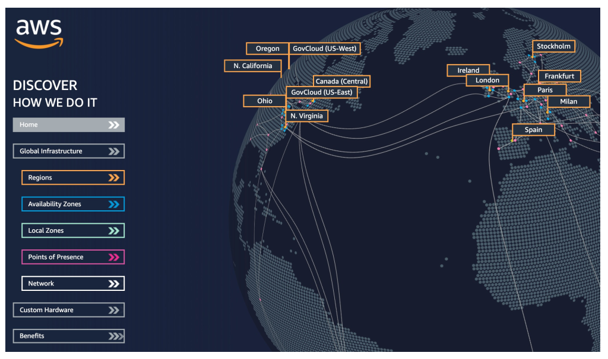
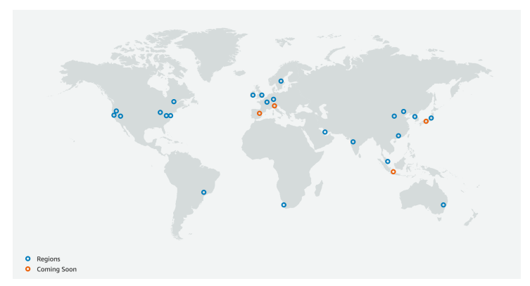
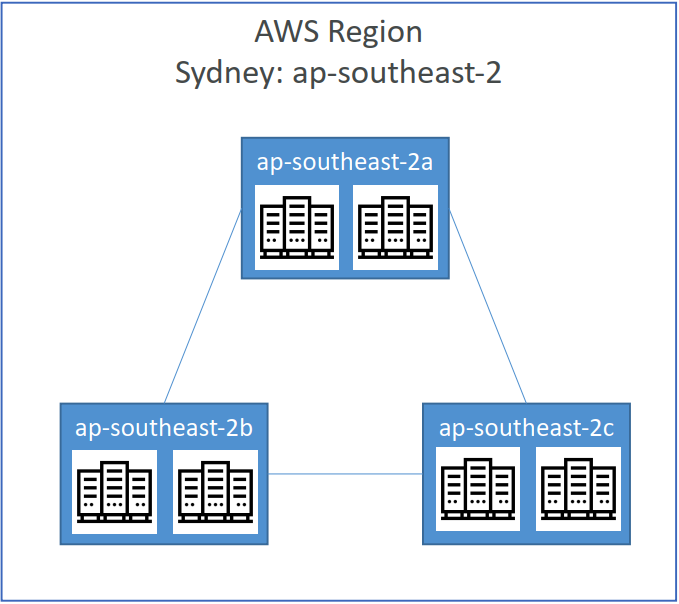
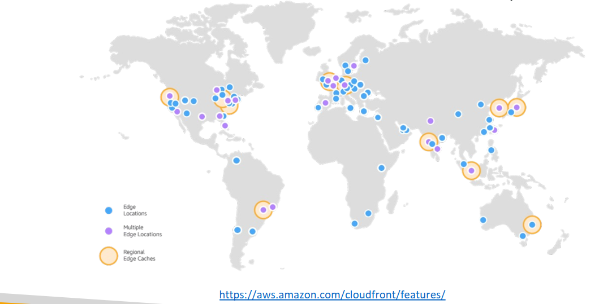

# Introduction to AWS

## What’s AWS?

- **AWS (Amazon Web Services)** is a Cloud Provider
- They provide you with `servers` and `services` that you can use on demand and scale easily

#### AWS Cloud Use Cases

- AWS enables you to build sophisticated, scalable applications
- Applicable to a diverse set of industries
- Use cases include
    - Enterprise IT, Backup & Storage, Big Data analytics
    - Website hosting, Mobile & Social Apps
    - Gaming

## AWS Global Infrastructure

- AWS Regions
- AWS Availability Zones
- AWS Data Centers
- AWS Edge Locations / Points of Presence

### Region

- AWS has **Regions** all around the world
    - Ex: `us-east-1`, `ap-south-1`, `eu-west-3`

- A region is a **cluster of data centers**

- Most AWS services are **region-scoped**

- **Consideration when selecting a region**
    - **Compliance with data governance and legal
requirements:** data never leaves a region without
your explicit permission (some countries require the data to be present in a data centre present in that country by law)
    - **Proximity to customers:** reduced latency
    - **Available services within a Region:** new services and new features aren’t available in every Region
    - **Pricing:** pricing varies region to region and is transparent in the service pricing page

### Availability Zone (AZ)

- Each region has many availability zones
(usually 3, min is 3, max is 6)
    - Ex: `ap-southeast-2a`, `ap-southeast-2b`, `ap-southeast-2c`

- Each `availability zone (AZ)` is one or more discrete data centers with redundant power, networking, and connectivity

- They’re separate from each other, so that
they’re isolated from disasters

- They’re connected with high bandwidth,
ultra-low latency networking

> 
>
> AZ name (eg. `us-east-1a`) is linked to an AWS account. **Same AZ name for two AWS accounts might not refer to the same physical AZ**. Use **AZ ID** (unique ID for each AZ) to coordinate AZ across accounts.

### AWS Points of Presence (Edge Locations)

- Amazon has 400+ Points of Presence (400+ Edge Locations & 10+
Regional Caches) in 90+ cities across 40+ countries

- Content is delivered to end users with lower latency

### AWS Global and Region-scoped Services:

- AWS has Global Services:
    -  Identity and Access Management (IAM)
    - Route 53 (DNS service)
    - CloudFront (Content Delivery Network)
    - WAF (Web Application Firewall)

- Most AWS services are Region-scoped:
    - Amazon EC2 (Infrastructure as a Service)
    - Elastic Beanstalk (Platform as a Service)
    - Lambda (Function as a Service)
    - Rekognition (Software as a Service)

- Region Table: https://aws.amazon.com/about-aws/global-infrastructure/regional-product-services

